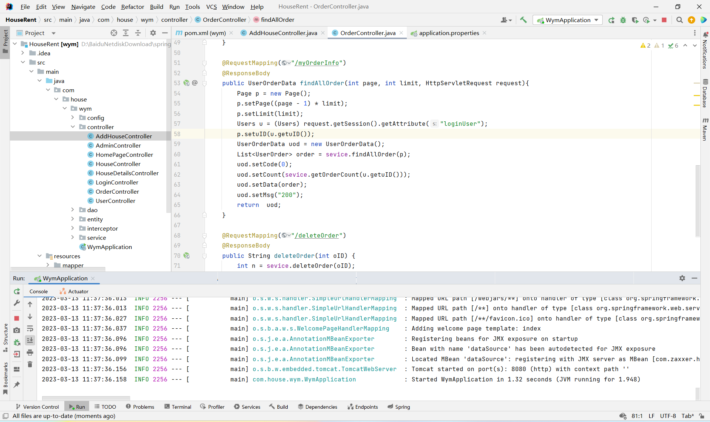
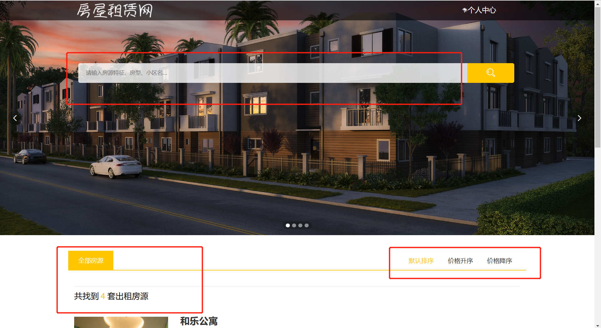
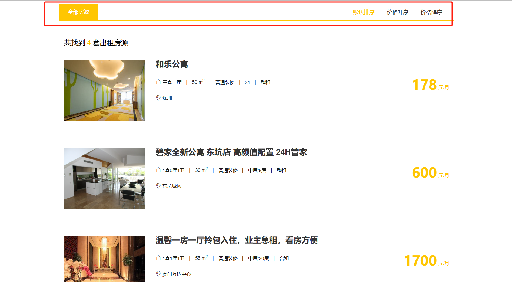
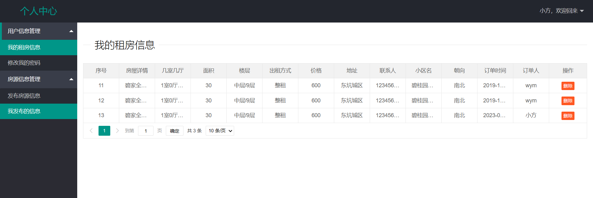
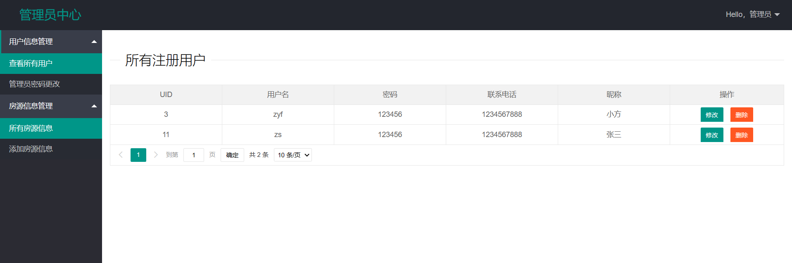
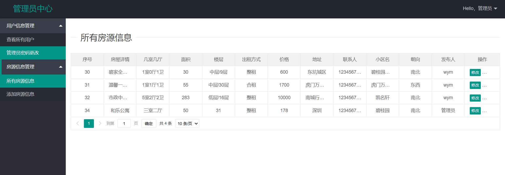
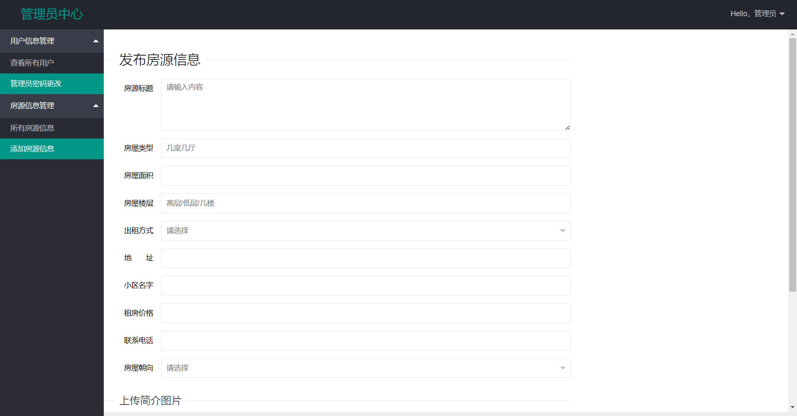

# 租房系统(SpringBoot+MyBatis)

### 9.9￥ 获取完整源码+sql，需要加Q：3577148218 ,备用Q: 3808981644
### 有问题，或者需要协助调试运行项目的也可联系
### 更多项目： https://github.com/34426?tab=repositories

### 介绍

房屋出租系统/房屋租赁网站

开发框架 : SpringBoot+MyBatis

### 用户端：

1、登录注册 2、查看房源并预定 3、密码修改 4、查看自己的预定 5、发布个人房源 6、查询房源 7、查看自己发布的房源信息

### 用户端部分页面展示

### 管理员端部分页面展示

1、用户管理 2、查看所有用户 3、密码更改 4、查看所有房源信息 5、添加房源信息 

### 9.9￥ 获取完整源码+sql，需要加Q：3577148218 ,备用Q: 3808981644
### 有问题，或者需要协助调试运行项目的也可联系

