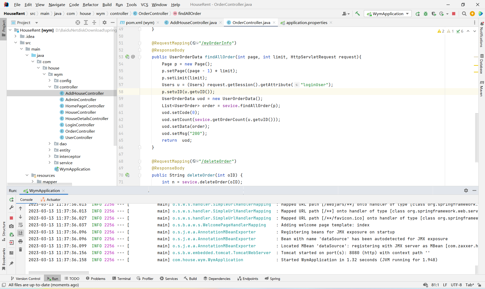
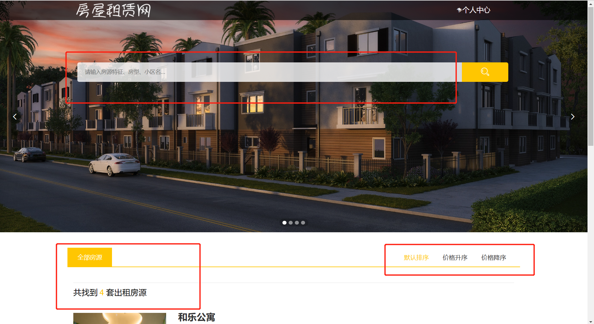
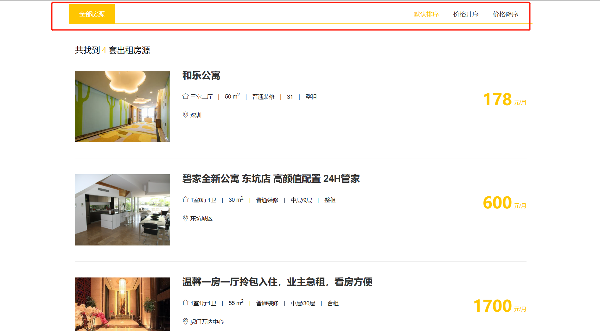
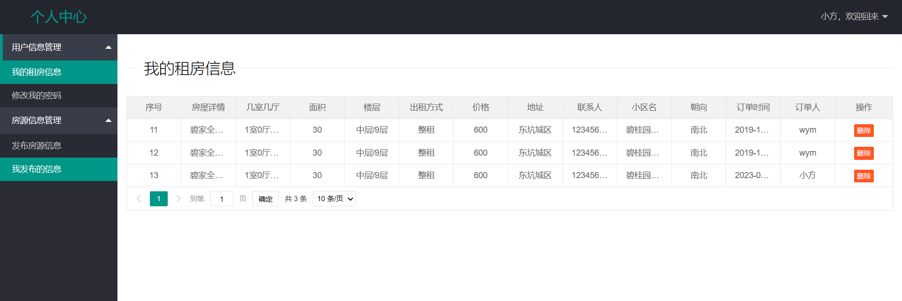
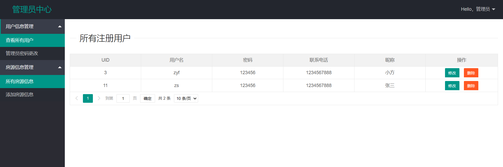
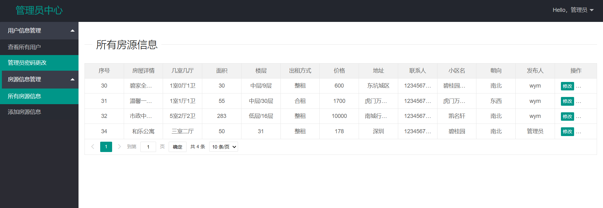
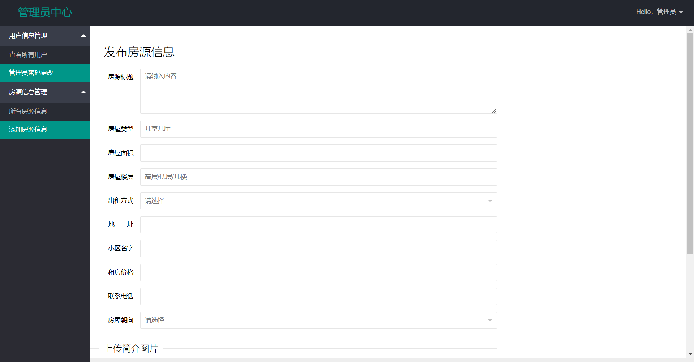

# 租房系统(SpringBoot+MyBatis)

### 完整项目获取

通过网盘分享的文件：SSM房屋租赁系统

链接: https://pan.baidu.com/s/1vJEo19YPxN_mH594hPq-oA?pwd=seid 提取码: seid
--来自百度网盘超级会员v3的分享

通过网盘分享的文件：工具包

链接: https://pan.baidu.com/s/1YmdoJvkjoUjA75wvHLDZ6A?pwd=xm96 提取码: xm96
--来自百度网盘超级会员v3的分享

需要远程项目部署或项目修改和毕业设计也可联系（添加申请时请备注好来意）

通过网盘分享的文件：远程调试部署联系方式

链接: https://pan.baidu.com/s/1W0dDcoZmayG0c7USJDYBYg?pwd=nqd7 提取码: nqd7
--来自百度网盘超级会员v3的分享

### 项目合集(项目不断更新中)
链接: https://pan.baidu.com/s/1nY-zhvAK0CXYcn3g7LzQnQ?pwd=id3c 提取码: id3c
--来自百度网盘超级会员v3的分享

#### 这些项目一起发你了 可以分享给你需要的同学 调试可找我 也接二次修改和项目定制、毕业设计等

## 接毕业设计和论文

微信联系方式：xzxj0206  QQ：3808981644   (支持修改、 部署调试、 支持代做毕设)

接网站建设、小程序、H5、APP、各种系统等，单片机、嵌入式也可以做

选题+开题报告+任务书+程序定制+安装调试+论文+答辩ppt  都可以做

### 介绍

房屋出租系统/房屋租赁网站

开发框架 : SpringBoot+MyBatis

### 用户端：

1、登录注册 2、查看房源并预定 3、密码修改 4、查看自己的预定 5、发布个人房源 6、查询房源 7、查看自己发布的房源信息

### 用户端部分页面展示

### 管理员端部分页面展示

1、用户管理 2、查看所有用户 3、密码更改 4、查看所有房源信息 5、添加房源信息 

